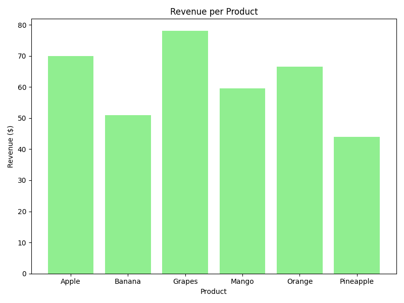
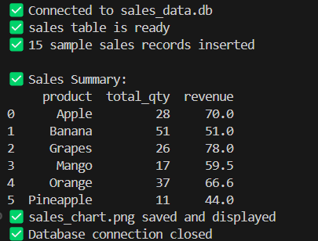

# 📊 Sales Summary Dashboard – Python & SQLite Project

---

## 🔍 Overview
This project demonstrates a **simple Sales Summary Dashboard** built using **Python**, **SQLite**, **pandas**, and **matplotlib**. It connects to a local SQLite database, runs SQL queries to summarize sales data (like total quantity and revenue), and visualizes the results with a bar chart.

## 🧠 Objectives

- Store and manage sales data using SQLite  
- Run SQL queries to calculate total quantity sold and revenue per product  
- Load query results into pandas DataFrame for easy analysis  
- Visualize sales revenue using a simple bar chart  

## 🛠 Tools & Technologies

- Python (3.x)  
- SQLite (via built-in `sqlite3` module)  
- pandas  
- matplotlib  

## 📈 Dashboard Features

- **Data Storage**: Local SQLite database file (`sales_data.db`)  
- **ETL**:
  - Inserts ~15 sample sales records if the table is empty
  - Runs SQL aggregation to calculate:
    - Total quantity sold per product
    - Total revenue per product  
- **Output**:
  - Prints summary table to console
  - Plots and saves a bar chart of revenue by product

## 🏆 Highlights

- Fully self-contained Python script  
- Uses SQLite with no external setup needed  
- Clean, beginner-friendly code and SQL  
- Visual output with matplotlib for easy insights  

## 📷 Screenshots

### Output

## 📄 License

This project is released under the [MIT License](LICENSE).  
Feel free to use, modify, and share it with attribution.
